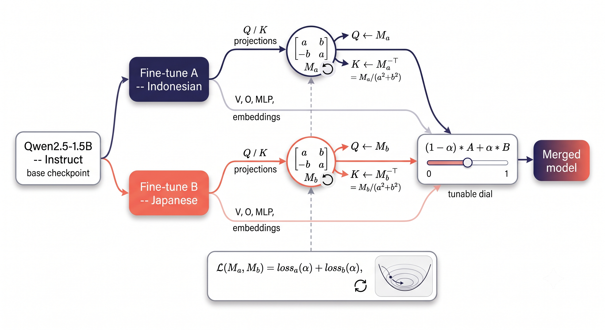

# MeRoTune



Papaer: https://arxiv.org/abs/2609.07971

Merging two fine-tunes by averaging their weights implicitly assumes
both models already agree on how their RoPE (rotary position
embedding) pairs are oriented. Nothing guarantees that. Two checkpoints
fine-tuned independently from the same base have no reason to land on
the same internal rotation convention for their query/key subspaces,
and if they don't, plain-averaging their K/Q projections quietly
scrambles the relative-position structure RoPE is there to provide.

The fix has to *commute* with RoPE's rotation, or it breaks the same
thing it's trying to preserve. The only real 2x2 matrices that commute
with every rotation angle are `[[a, b], [-b, a]]` -- a scaled rotation.
MeRoTune learns one such matrix per (layer, kv-head) for each of the
two models being merged, then blends them with a single dial (`alpha`)
you can move after training, without retraining.

Targets Qwen2.5-1.5B-Instruct specifically (28 layers, 12 query heads,
2 kv heads, head_dim 128, bias on q/k proj). Not written to generalize
past that architecture -- that's what was tested. Full derivation,
mathematical guarantees, and benchmark results are in the paper; this
repo is the code that produced them.

## Layout

```
merotune/           the method itself, importable
  constrained_m.py     the transform: two learnable scalars (a, b) per RoPE pair
  qwen_merge_utils.py  merge/training helpers, hardcoded to Qwen2.5-1.5B's shapes
scripts/             the runnable entry points
  train.py             trains M_a, M_b for a given pair
  merge.py             builds a merged model at a chosen alpha
  evaluate.py          benchmarks saved model directories
data/                example data format
```

Before using this on a new pair, check by hand that both models share
the same architecture, hidden size, layer/head counts, and vocab size
(a mismatch crashes the merge with a shape error), and that both
configs declare RoPE (`rope_theta`, `rope_scaling`, or
`rope_parameters`) -- that's what the method's safety guarantee
depends on. Neither of these confirms the two models actually descend
from the same upstream checkpoint; that isn't recoverable from config
files alone.

## Setup

```bash
pip install -r requirements.txt
```

## Running it, step by step

**1. Train.** Learns `M_a` and `M_b` against your two retention
datasets (see `data/README.md` for the format).

```bash
python scripts/train.py \
    --model-a arissuga/aurum-brain-ai \
    --model-b SakanaAI/TinySwallow-1.5B-Instruct \
    --data-a data/example_a.json \
    --data-b data/example_b.json \
    --out checkpoints/
```

**2. Merge, at whatever alpha you want.** `alpha` is the fraction of
model B in the blend: `0.0` is pure A, `1.0` is pure B. Produces an
ordinary HF model directory.

```bash
python scripts/merge.py \
    --model-a arissuga/aurum-brain-ai \
    --model-b SakanaAI/TinySwallow-1.5B-Instruct \
    --checkpoints checkpoints/ --alpha 0.1 --out merged-alpha0.1/
```

**3. Evaluate it.**

```bash
python scripts/evaluate.py \
    --models Qwen/Qwen2.5-1.5B-Instruct arissuga/aurum-brain-ai \
             SakanaAI/TinySwallow-1.5B-Instruct merged-alpha0.1/ \
    --tasks mmlu arc_challenge include_base_44_indonesian include_base_44_japanese \
    --limit 100
```

`alpha` is a knob to sweep and commit to for your actual deployment
need, not something guaranteed to move smoothly or monotonically
across its range -- see the paper for why.

## License

MIT
